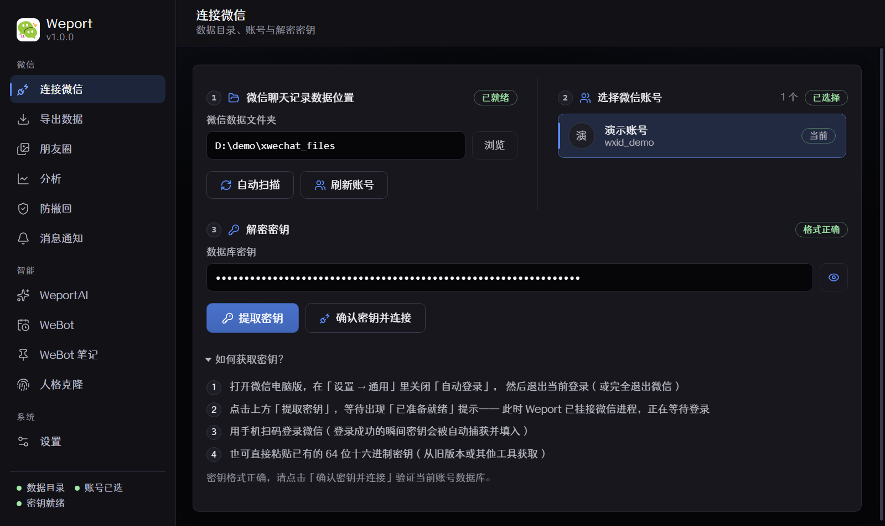
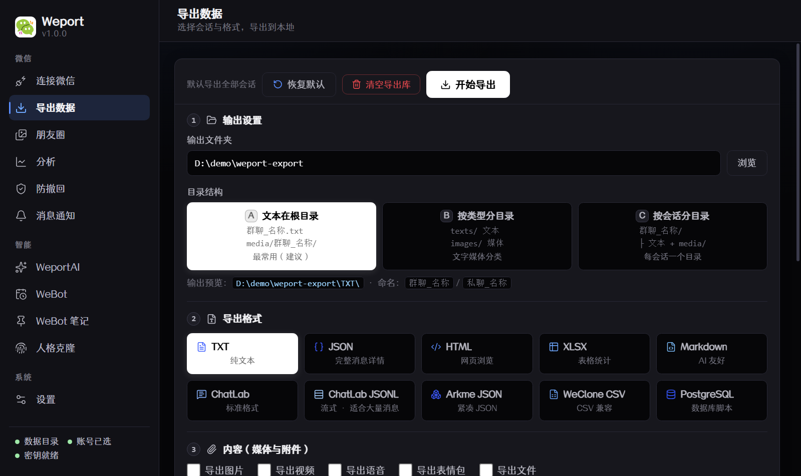
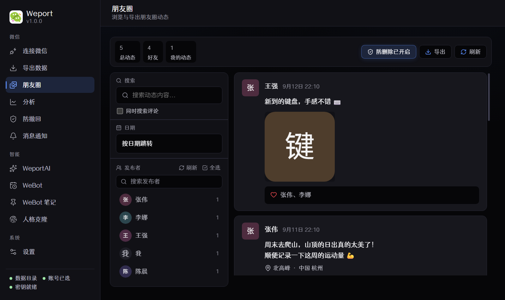
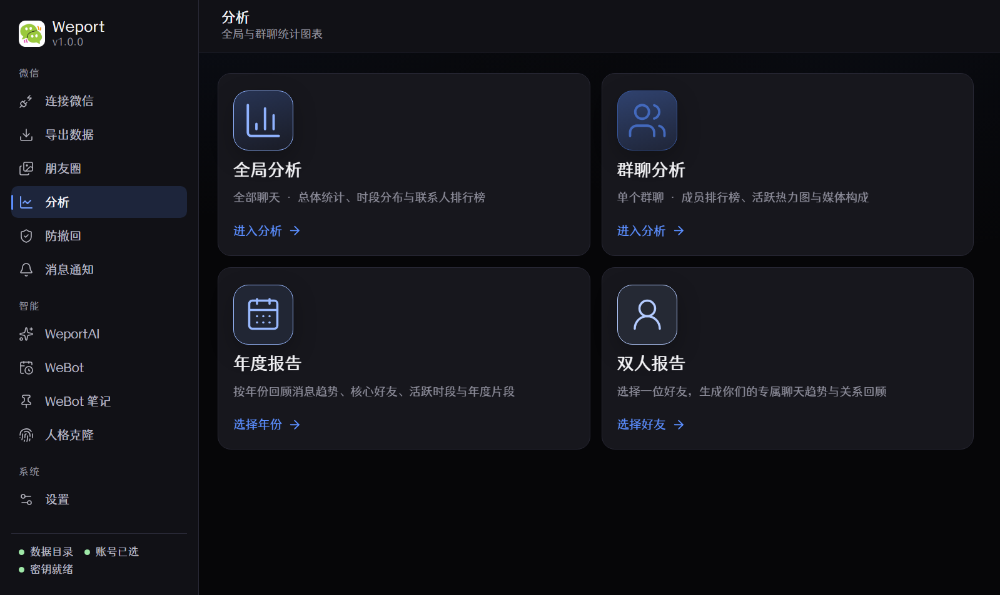
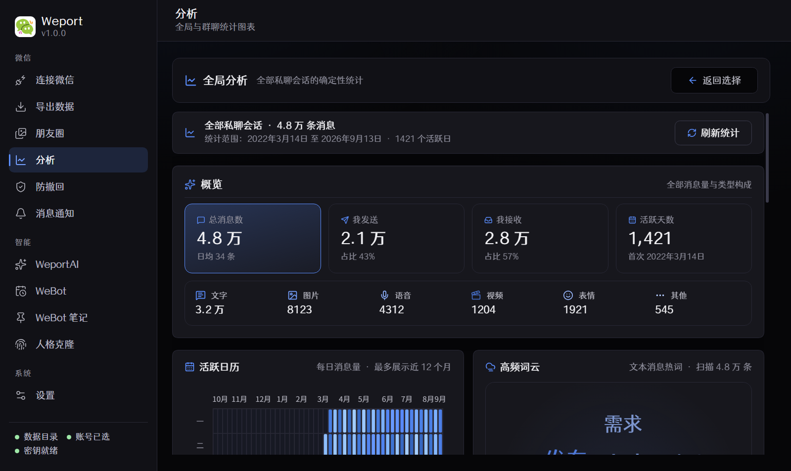
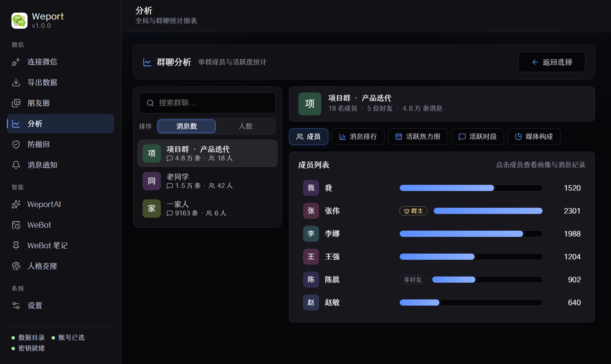
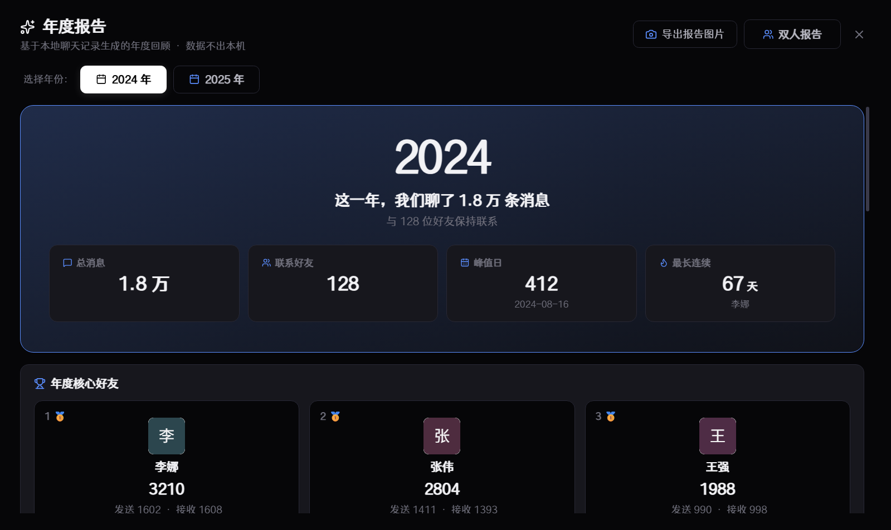
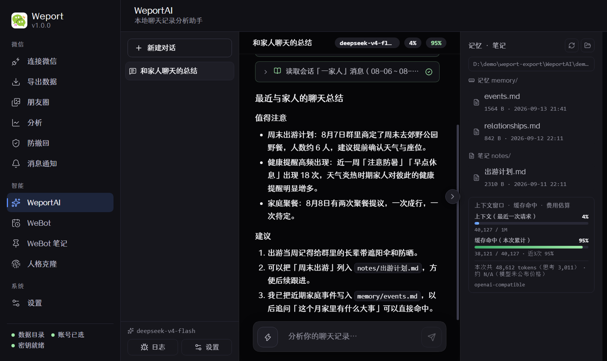
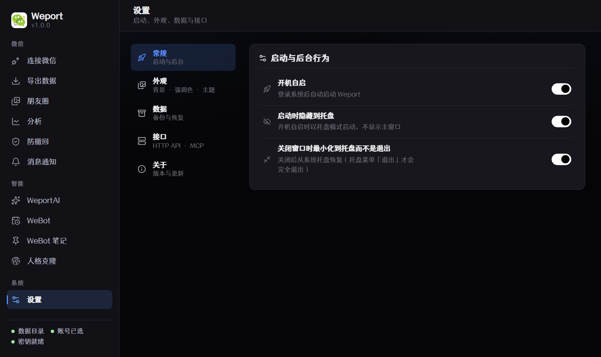

<p align="center">
  
</p>

<h1 align="center">Weport</h1>

<p align="center">
  <b>轻量、本地化的微信聊天记录导出与分析工具（Windows · macOS）</b><br />
  一键导出所有聊天记录 · 朋友圈快速查询 · 消息防撤回 · 朋友圈防撤回 · 微信数据分析 · 新消息置顶弹窗 · WeportAI 聊天历史分析助手
</p>

<p align="center">
  
  
  
  
</p>

---

## ✨ 这是什么？

Weport 可以把微信 4.x 的本地聊天数据导出成你自己可以掌控的形式：一键导出全部私聊和群聊、离线浏览历史朋友圈、统计这一年聊了谁最多 —— 所有处理都在本机完成。想直接问问题？WeportAI 可以对聊天记录提问、总结、复盘。

- 🔒 **本地优先** — 你的微信数据不会被上传！
- 📦 **一键导出** — 可以一键导出全部私聊 + 群聊，也可选择导出单个聊天
- 🎨 **10种格式** — TXT / JSON / HTML / XLSX / Markdown / ChatLab / SQL 等等
- 🖼️ **朋友圈归档（v0.9）** — 浏览历史朋友圈、按人/关键词/日期筛选、图片视频解密预览、导出（JSON/HTML/ARKME/Markdown）、以及防朋友圈删除
- 📊 **数据分析（v0.9）** — 一键生成全局统计（时段分布、联系排行榜、排除名单）、群聊分析（成员排行、活跃热力图、媒体构成、成员画像）、年度报告
- 🤖 **WeportAI** — 独立研发的Agent Harness, 支持所有主流AI提供商，聊天历史分析助手，带 17 个检索/分析工具，以及对你的长期记忆
- 🔔 **消息提醒** — 独立置顶弹窗，新消息与撤回即时通知（可按会话过滤）
- 🛡️ **防撤回** — 会话级 WCDB 触发器，撤回的消息在微信本地仍然可见
- 🚀 **托盘常驻** — 开机自启、静默启动、关闭最小化到托盘

## 📸 截图

**连接微信** —— 选择数据目录、扫描账号、一键提取解密密钥：



**导出数据** —— 格式、目录结构、媒体与高级选项一目了然：



**朋友圈** —— 全量时间线，左侧按发布者 / 关键词 / 日期筛选，媒体本地解密预览：



**分析入口** —— 全局分析与群聊分析，两块入口并排选择：



**全局分析** —— 消息类型构成、时段分布、联系排行榜与统计排除名单：



**群聊分析** —— 成员列表、消息排行、活跃时段与媒体构成：



**年度报告** —— 一年到头，聊了谁最多、哪一天最热闹：



**WeportAI** —— 对聊天记录提问：工具调用、思考过程与 Markdown 结论，右侧为长期记忆与笔记：



**设置** —— 开机自启、启动行为与色彩主题（浅蓝 / 黑白）：



**通知弹窗** —— 液态玻璃风格，置顶显示、不抢焦点：


## 🚀 快速开始

### Windows

1. 从 [Releases](https://github.com/Panther114/Weport/releases) 下载最新安装包（`Weport-*-Setup.exe`）并安装
2. 打开 Weport，在「连接微信」页选择数据目录（自动检测 `xwechat_files` 文件夹）
3. 按页面提示**获取解密密钥**（见下方说明）
4. 切到「导出数据」页，选择格式与输出文件夹，点击**导出全部聊天记录**

### macOS（Apple Silicon）

1. 从 [Releases](https://github.com/Panther114/Weport/releases) 下载最新安装包（`Weport-*-arm64.dmg`），打开后将 Weport 拖入「应用程序」
2. 首次打开：右键 Weport →「打开」（未经 Apple 公证的 ad-hoc 签名应用首次需要手动放行）
3. 打开 Weport，在「连接微信」页选择数据目录（自动检测 `~/Library/Containers/com.tencent.xinWeChat/...`）
4. 按页面提示**获取解密密钥**（见下方说明）
5. 切到「导出数据」页，选择格式与输出文件夹，点击**导出全部聊天记录**

> macOS 自动获取密钥依赖系统调试权限（`task_for_pid`）：需要**关闭 SIP**（`csrutil disable`）或在系统提示授权时输入管理员密码；获取失败时界面会给出当前微信版本对应的排障步骤。防撤回、导出与弹窗功能不需要关闭 SIP。

### 🔑 获取解密密钥（重要）

密钥在**微信登录的瞬间**被捕获，无法从已登录的会话中直接读取：

1. 打开微信电脑版，在「设置 → 通用」里**关闭「自动登录」**，然后退出当前登录
2. 点击 Weport 中的**「提取密钥」**，等待出现「已准备就绪」提示
3. 用手机**扫码登录微信** —— 登录成功的瞬间密钥会自动捕获并填入
4. 也可以手动粘贴已有的 64 位十六进制密钥

## 🤖 WeportAI · 聊天历史分析助手

WeportAI 把你自定义的模型与 17 个本地检索工具组合成一个**可推理的 agent**——不用写查询，直接用自然语言问自己的聊天记录（v0.8 起）。WeportAI会将发现自动写入长期记忆。

**可以这样问：**

| 提问 | 它能做什么 |
|------|-----------|
| 「分析我是什么人」 | 全量扫描所有会话与时间窗，输出人格画像 |
| 「8月8日发生了什么」 | 跨会话重建当天的完整时间线 |
| 「我和小明的聊天关系怎么样」 | 互动模式、话题分布与关系状态分析 |
| 「搜一下我们什么时候提过露营」 | 全文关键词搜索，带回原文上下文 |

**工作方式：**

- **工具链**：会话列表、时间线重建、全文搜索、群成员、会话统计、联系人资料、关系筛选等 17 个工具，AI 按需调用并展示每一步的思考过程与调用结果
- **长期记忆**：所有发现持续写入导出目录下的 `WeportAI/memory/`（跨对话共享）；单次分析的草稿笔记存于 `notes/`
- **成本透明**：每次运行显示上下文窗口占用、DeepSeek 提示词缓存命中率与费用估算
- **完全可控**：模型、API 地址、最大步数、快捷动作、可用工具都可在设置中调整

> 🔐 隐私：分析时仅把**聊天文本**发送给你配置的模型 API。密钥、文件、头像、原始数据库均不会离开本机；调试日志对密钥等敏感内容做脱敏处理。

## 🖼️ 朋友圈（v0.9）

微信的本地 `sns.db` 存着你的全部朋友圈，Weport 直接读它，离线就能翻任意历史动态：

- **全量浏览** — 分页时间线，按发布者、关键词、日期快速筛选；点击发布者可查看其全部动态
- **媒体解密** — 图片/实况照片/视频经本地解密后直接预览（内存缓存 + 磁盘缓存加速，无需重新下载）
- **导出** — JSON / HTML / ARKME JSON / Markdown 四种格式，支持时间范围与媒体文件（图片/实况/视频）选择，后台进度可取消
- **防删除** — 一键安装朋友圈删除拦截触发器（WCDB 触发器），被删除的动态在本地仍然可见；也可单独删除某条记录
- **旧缓存迁移** — 自动检测旧版朋友圈媒体缓存目录并迁移，加速历史媒体加载

## 📊 微信数据分析（v0.9）

「分析」模块把所有非 AI 的统计放进一个入口，两块选择：**全局分析**（自己所有私聊的整体画像）与**群聊分析**（单个群的成员与活跃度）：

- **全局分析** — 全部私聊会话的总体统计（消息类型构成、24 小时/星期/月度分布、我的每日消息）、联系排行榜 Top 20、统计排除名单（公众号/广告账号一键排除并即时重算），以及**年度报告**（年度核心好友、每月聊得最多的人、全年 7×24 活跃热力图、深夜王者、互相奔赴、响应速度、高频短语、朋友圈年度统计等，可导出报告图片）
- **群聊分析** — 选择任意群聊：成员列表（群主/好友标识、消息占比条）、消息排行 Top 20、24 小时活跃时段、媒体构成；点击成员查看画像（统计卡片、活跃时段、高频短语、常用表情、消息记录分页）并可导出 CSV

所有统计基于本地数据实时计算，支持缓存清理与强制刷新，不依赖任何外部服务。

## 📦 导出格式

| 格式 | 说明 |
|------|------|
| TXT / JSON | 纯文本与完整消息详情，通用格式 |
| HTML | 网页格式，浏览器直接打开浏览 |
| XLSX | 电子表格，适合统计分析 |
| Markdown | 支持文本、图片与链接，适合 AI 场景 |
| ChatLab / JSONL / Arkme JSON | 标准聊天格式，可导入其他软件 |
| WeClone CSV | WeClone 兼容字段 |
| PostgreSQL SQL | 数据库脚本，便于导入数据库 |

支持按会话分目录 / 按类型分目录两种组织方式，媒体文件（图片、视频、语音、表情包、文件）可选导出。

## 🛠️ 开发

环境要求：Node 20+。Windows / macOS 均可开发与构建（构建需在对应平台上进行）。

```sh
npm install                       # 安装依赖（Windows 额外同步运行时 DLL）
npm run dev                       # 开发模式（vite + electron）
npm run typecheck                 # 渲染进程 + 主进程类型检查
npm run build                     # Windows: 构建 NSIS 安装包（release/ 目录）
npm run build:dir                 # 免安装构建（迭代更快）
npm run build:mac                 # macOS: 构建 DMG + ZIP（arm64）
powershell -ExecutionPolicy Bypass -File scripts/capture-ui.ps1   # Windows UI 冒烟测试（自动截屏 + 内容断言）
powershell -ExecutionPolicy Bypass -File scripts/capture-ui.ps1 -PublishToDocs   # 生成并发布 README 截图
```

macOS 打包前需为密钥 helper 恢复可执行位（Git 不跟踪 exec bit）：

```sh
chmod +x resources/key/macos/universal/xkey_helper \
  resources/key/macos/universal/xkey_helper_macos \
  resources/key/macos/universal/image_scan_helper \
  resources/key/macos/universal/libwx_key.dylib \
  resources/welive/macos/arm64/welive
```

`capture-ui.ps1` 以 `WEPORT_SCREENSHOT_POPUP` 模式启动应用：自动截取「连接 / 导出 / 防撤回 / 消息通知 / WeportAI / 朋友圈 / 分析入口 / 全局分析 / 群聊分析 / 年度报告 / 设置 / 通知弹窗」共 12 个画面并逐一断言非空。该模式**全部使用脱敏演示数据**（假路径、假密钥、演示账号），不会把真实个人信息截进 README；`-PublishToDocs` 会把截图发布到 `docs/screenshots/`。

v0.9 的端到端 QA 使用 `WEPORT_V09_DUMP=1` 模式：以脱敏演示数据驱动真实页面渲染（朋友圈 / 分析入口 / 全局分析 / 年度报告 / 群聊分析 / 成员画像），逐页断言关键 DOM 节点与渲染进程 console 错误数，结果写入 `WEPORT_V09_DUMP_OUT` 目录（JSON + 日志），失败退出码非 0：

```sh
$env:WEPORT_V09_DUMP = '1'
$env:WEPORT_V09_DUMP_OUT = "$env:TEMP\v09-dump"
.\release\win-unpacked\Weport.exe   # 全部断言通过时退出码 0
```

### 架构速览

| 目录 | 说明 |
|------|------|
| `electron/appMain.ts` | 主进程：窗口、托盘、IPC、更新、导出、通知管线、朋友圈/分析/年度报告 IPC、QA 截图与 v0.9 转储模式 |
| `electron/services/` | 引擎（WeFlow WCDB 栈的 TypeScript 移植）：会话、WCDB、密钥、导出、推送、朋友圈（`snsService.ts`）、全局分析（`analyticsService.ts`）、群聊分析（`groupAnalyticsService.ts`）、年度报告（`annualReportService.ts` + `annualReportWorker.ts`）、媒体解密（`isaac64.ts` / `wasmService.ts`） |
| `electron/services/weportAiService.ts` | WeportAI：agent 循环、工具调用、记忆/笔记工作区、脱敏日志 |
| `electron/wcdbHost.ts` | WCDB 宿主子进程（`WeFlow[.exe] --wcdb-host` 硬链接运行，IPC 通信） |
| `electron/windows/notificationWindow.ts` | 通知弹窗（Windows 液态玻璃 / 跨平台 Chromium 桌面流回退） |
| `src/pages/SnsPage.tsx` + `src/components/sns/` | 朋友圈界面：时间线、媒体网格、预览灯箱、作者动态、导出对话框 |
| `src/pages/analytics/` | 分析界面：入口选择（全局/群聊）、全局统计、群聊分析、年度报告（ECharts 双主题：浅蓝 / 黑白） |
| `src/` | React 渲染层（主界面 + 通知窗口 + WeportAI 面板） |
| `resources/` | 各平台原生库：`wcdb` / `key` / `wedecrypt` / `welive` / `runtime`（win32 + macos） |

## 🧭 行为约定

- 关闭窗口默认**最小化到托盘**，从托盘菜单「退出」才会完全退出（macOS 上关闭窗口同样隐藏，可从 Dock 菜单栏图标唤出）
- 开机自启支持**静默启动**（`--background`，不显示主窗口；Windows 写 Run 键，macOS 注册 LoginItem）
- 通知弹窗为独立置顶窗口，不抢占焦点；点击弹窗可唤出主窗口
- 数据目录与密钥保存在本机，重启后自动恢复

## 🖥️ 平台支持

| 平台 | 架构 | 安装包 | 备注 |
|------|------|--------|------|
| Windows | x64 | `.exe`（NSIS） | 微信 4.x，完整功能 |
| macOS | Apple Silicon（arm64） | `.dmg` / `.zip` | 微信 4.x；自动获取密钥需关闭 SIP 或按提示授权 |

> Intel Mac（x64）暂不支持；Linux 暂不支持。macOS 安装包为 ad-hoc 签名，首次打开需右键 →「打开」放行（或系统设置 → 隐私与安全性 → 仍要打开）。

## 🔐 隐私

所有处理都在本机完成。应用只读取你指定的微信数据目录，并在提取密钥时挂接微信进程捕获登录密钥；不会向任何服务器上传聊天内容。

WeportAI 例外：为了让模型回答问题，会把相关**聊天文本**发送到你在设置中配置的模型 API（默认 DeepSeek）。此功能默认关闭，只有当你填写 API 密钥后才启用；密钥仅保存在本机配置中，日志与截图均做脱敏处理。

## ⚠️ 免责声明

本工具仅供**个人学习与本地数据归档**使用。使用前请遵守微信《软件许可及服务协议》及所在国家/地区的法律法规，且仅允许处理**本人账号**的本地数据。因不当使用（包括但不限于侵犯他人隐私、违反微信服务条款、用于商业用途等）造成的一切后果由使用者自行承担，作者不对任何滥用行为负责。

## 📄 License

[MIT](./LICENSE) — 自由使用、修改与分发。
